# ts-gpt

[](<[https://www.github.com/novicezk/midjourney-proxy](https://github.com/dulaiduwang003/TIME-SEA-PLUS)>)
[](https://www.apache.org/licenses/LICENSE-2.0.html)


基于 SpringCloud Alibaba + SpringBoot3 构建的GPT项目
[在线演示地址](https://anchwngb.cn/)

### 功能介绍

`任意以及自定义GPT模型对话`  `GPT对话识图` `GPT对话生图` `GPT报错信息收集面板` `自定义对话参数预设` `ai写作` `小程序语音对话` `小程序对话` `DALL绘图(目前只有文生图,等官方完善还会继续) ` `SD绘图(支持文生图 图生图 实时渲染出图 进度展示 局部绘图) `
`预设词展示` `自定义外观` `自定义绘图参数(系统级)` `写的累了建议直接看本文档最下方的图片演示 .`
### 项目架构

> vue 网页端

* vue3
* element plus

> microservices 后端服务集

* ts-auth `处理登录 用户信息 商品交易 支付`
* ts-gateway `服务网关鉴权 路由 登录交易 白名单交易 路由 负载均衡`
* ts-common `公共工具类 公共配置 公共异常拦截 常量枚举`
* ts-api `存放公用DTO 远程调用接口 feigb`
* ts-drawing `处理绘图功能类服务`
* ts-chat `处理对话类功能服务`


* [SaToken](https://sa-token.cc/)
* [Redis](https://redis.io)
* [Maven](https://maven.io)
* [SpringBoot 3](https://spring.io/projects/spring-boot3)
* [Seata](https://github.com/seata/seata)
* [Nacos](https://nacosaaaasqsqwswqwq.io/zh-cn/)
* [Spring Cloud Gateway](https://spring.io/projects/spring-cloud-gateway)
* [Feign](https://spring.io/projects/spring-cloud-openfeign)
* [MySQL](https://www.mysql.com)

> wechat 小程序端

* uniapp
* vue3

### 部署环境以及准备工具

`Docker`
`MySQL8`
`Redis7`
`Nacos2.x`
`JDK17`
`阿里OSS服务`
~~`Seata`~~
`如单机部署 服务器最低要求 2c4m`
`SD绘图(非必须)`
`百度翻译API(非必须)`
`微信小程序APPID(目前非必须)`


### 前端执行命令
```shell
    ## 安装 yarn 命令
    npm install --global yarn  
```
```shell
    ## 安装 项目所需依赖
    yarn install
```
```shell
    ## 运行本地环境
    yarn run serve
```
```shell
    ## 打包构建
    yarn run build
```

### 后端所需的操作
>
>   `.sql`为 项目所需的 `.sql`目录 其中分为 data 和 table , data为含初始数据的建表sql 而table只有建表sql 无任何数据 ,可自行选择
>

>
>   `.nacos` 为本项目的配置 请在里面定义好自己的配置后导入 nacos中 
>

### 注意事项

>
> 项目每次增加模型或关于配置类的操作后 都要点击一次载入配置, 否则无法应用 除非重启
> 项目, 因为配置是在启动时加载至服务器内存(不是redis)构建, 修改后需要手动应用
>

>
> 服务器至少需要 2核4g内存 因为 nacos + mysql + redis大约占用 1.5 G , 这个还没有计算4个服务的容量,当然如果你服务器够多 可以自己多开实例做多实例分布式部署,也可以做单机部署
>

>
> 本项目不支持 一个SD由多个服务使用, 比如 你有一台SD服务器 ,然后你和你的朋友的第三方项目共享一个SD,这样会出现严重问题,因为本项目接入了实时渲染 而SD只支持单QS 会导致实时渲染效果出错,当然如果需要支持 Vme50 😍
>

>
> 某些功能故障 请使用管理账号登录系统 可以到 异常面板中查看 具体报错信息 (含具体优先级)
>

>
> 如果你喜欢这个项目点个小心心吧 Bug反馈请联系作者微信 `islamdlron`
>

### 打赏作者 
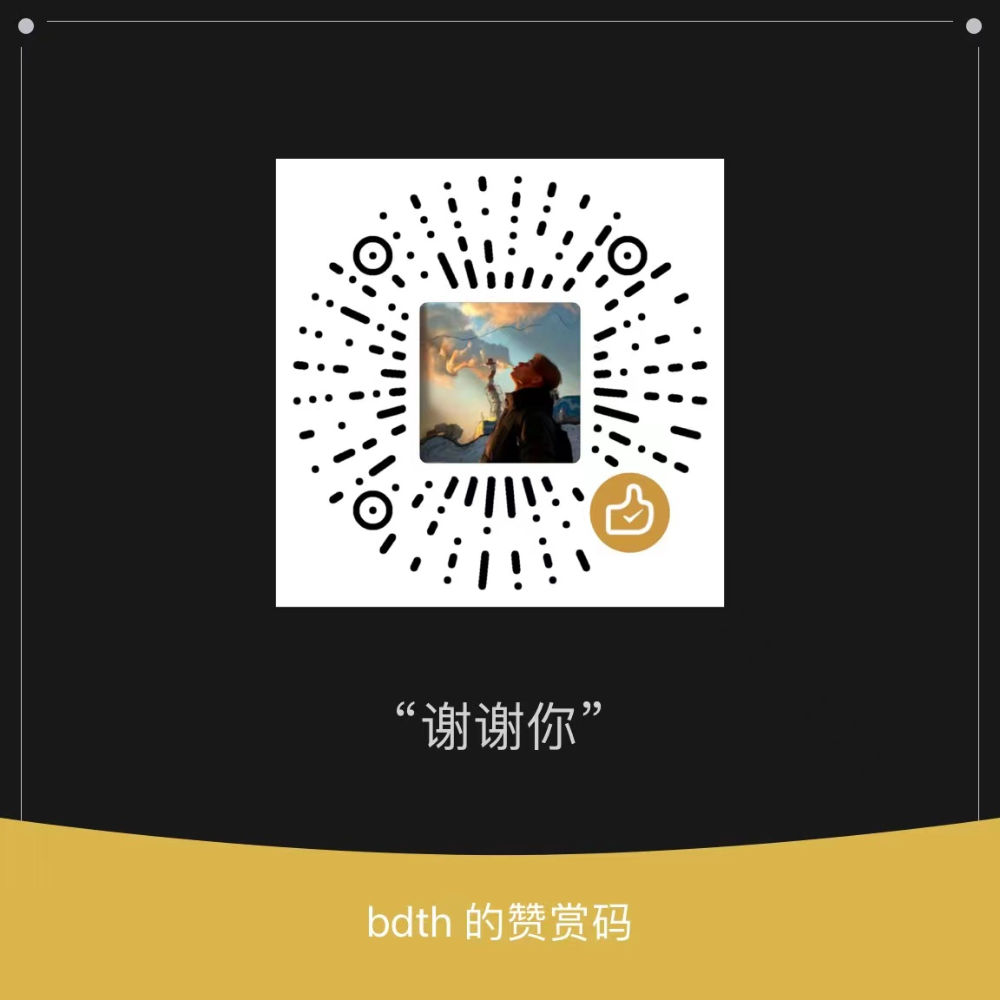


### 项目部分图片演示
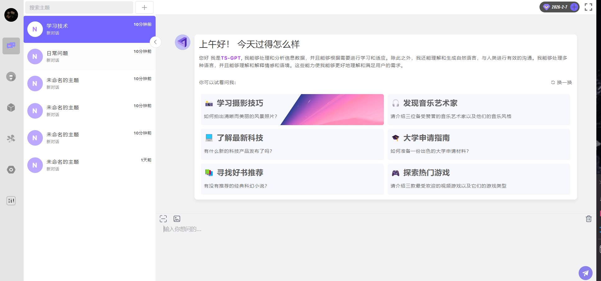
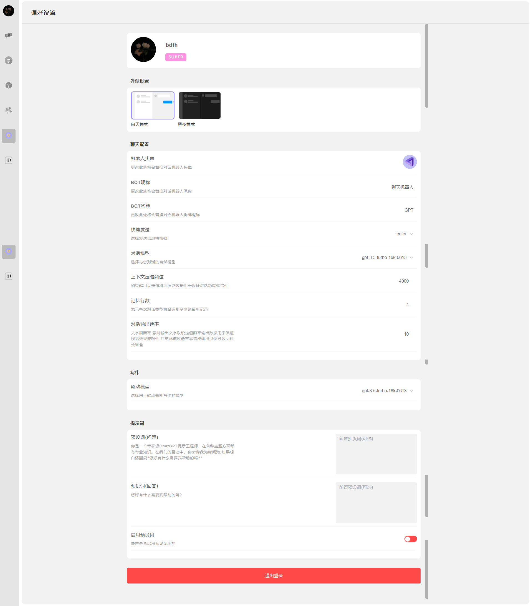
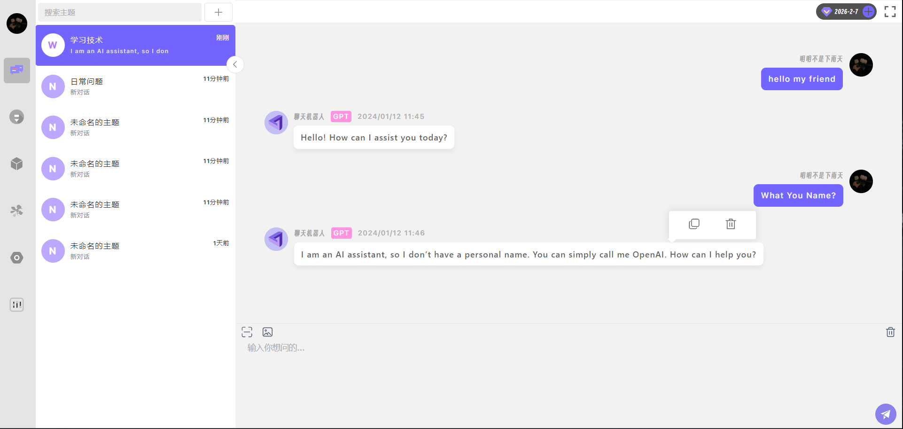
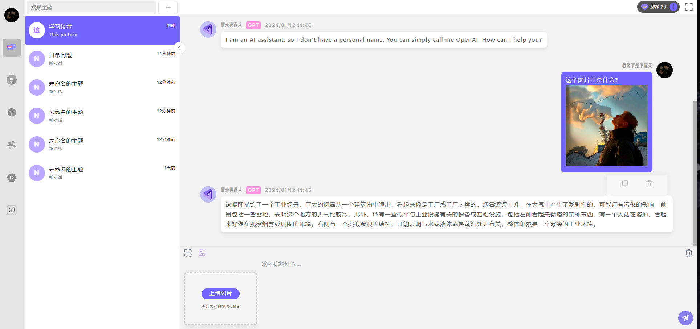
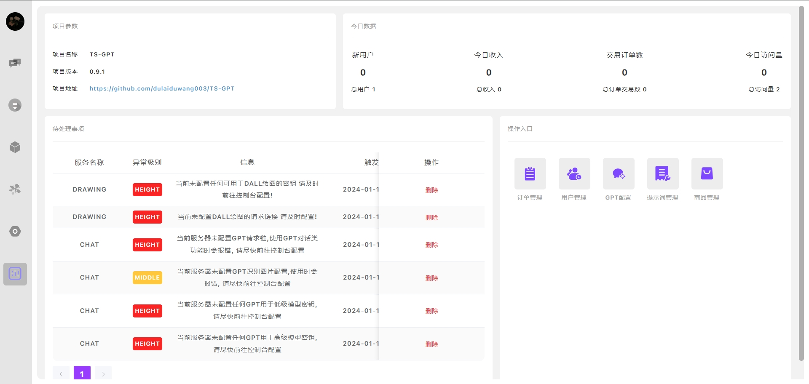
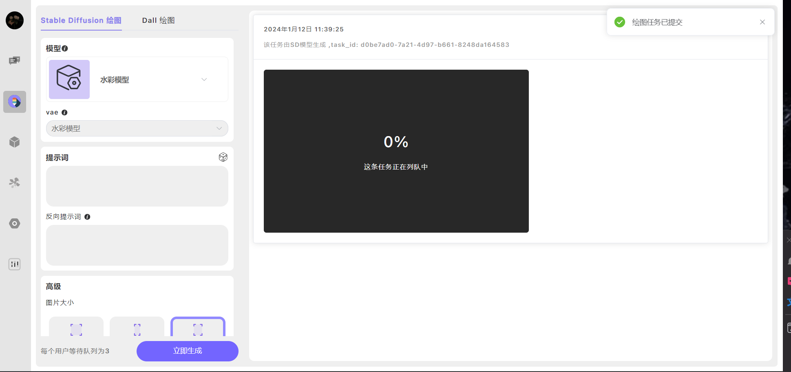
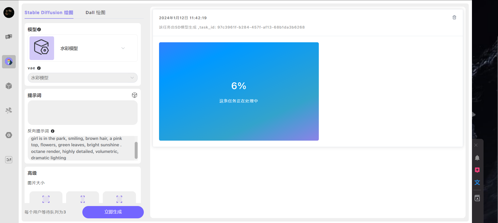
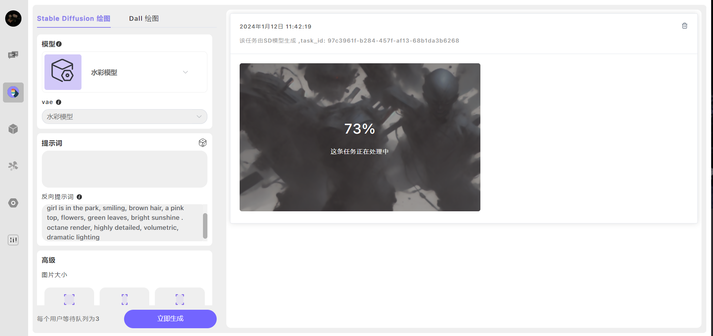

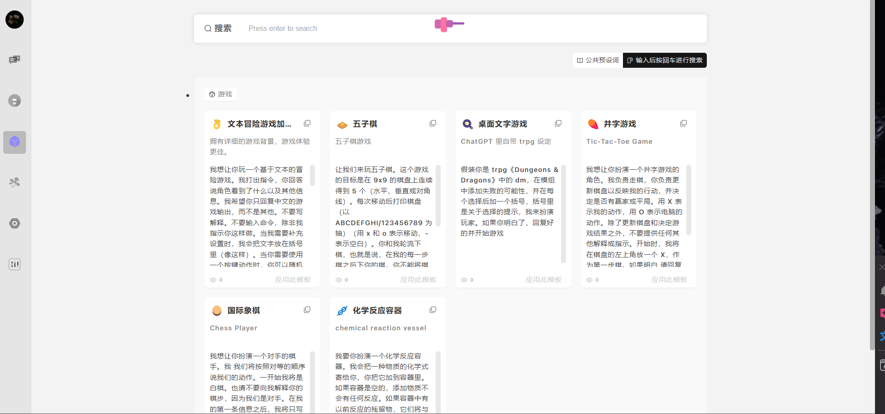
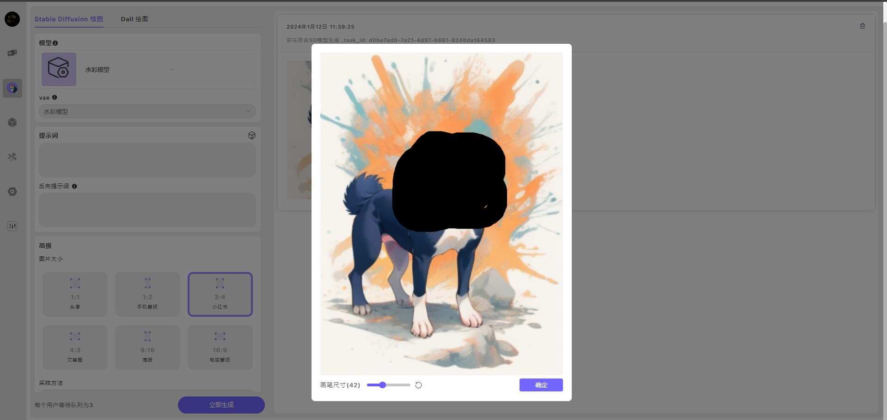
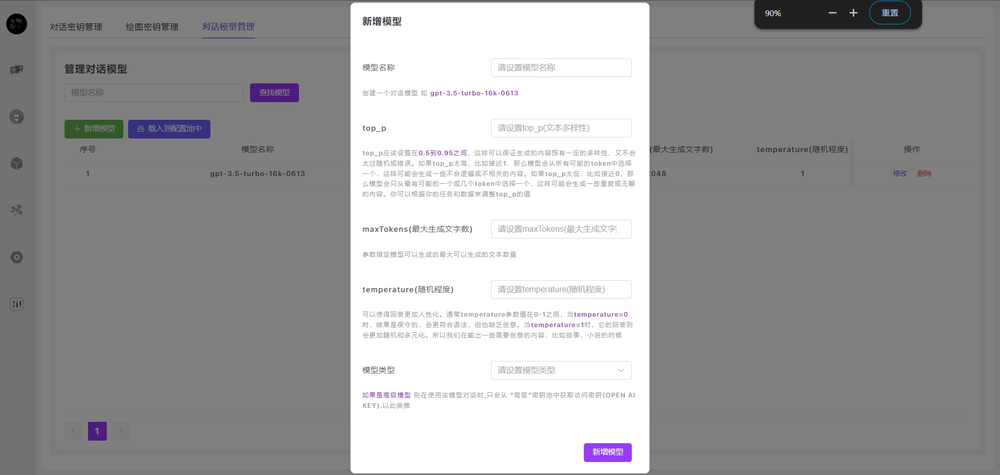
